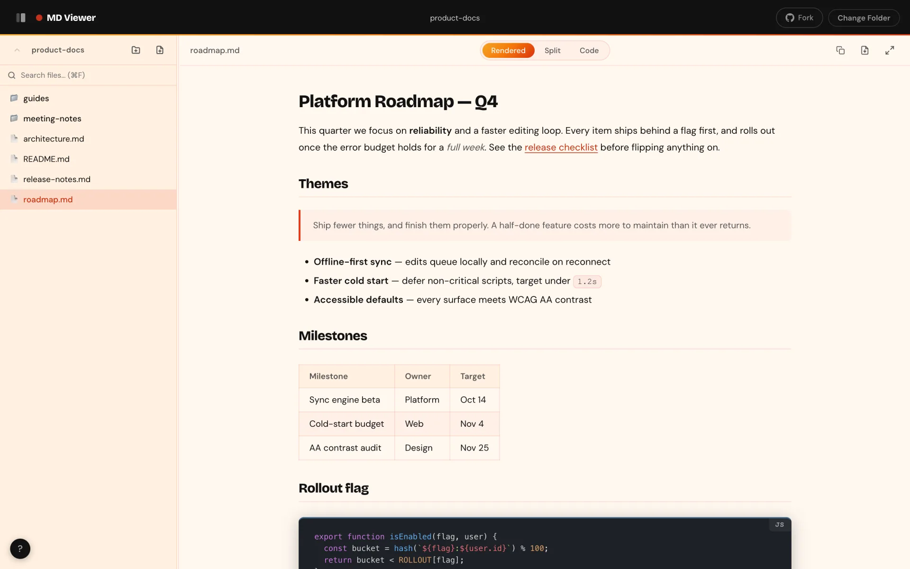
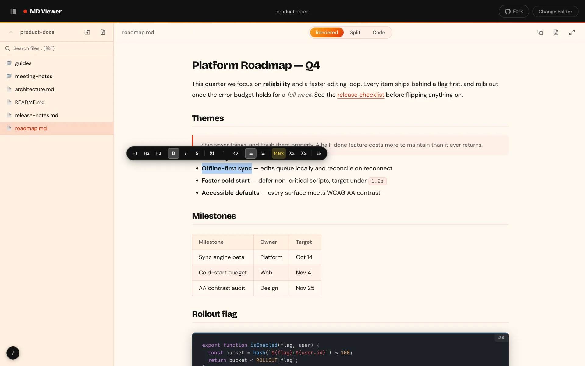
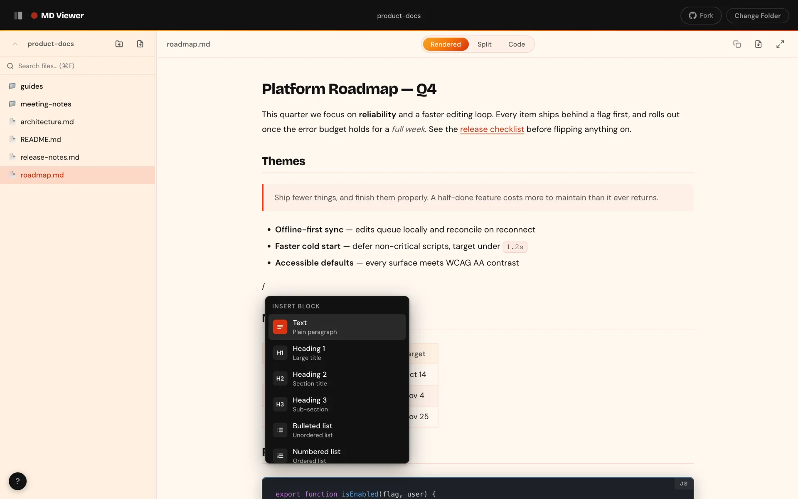
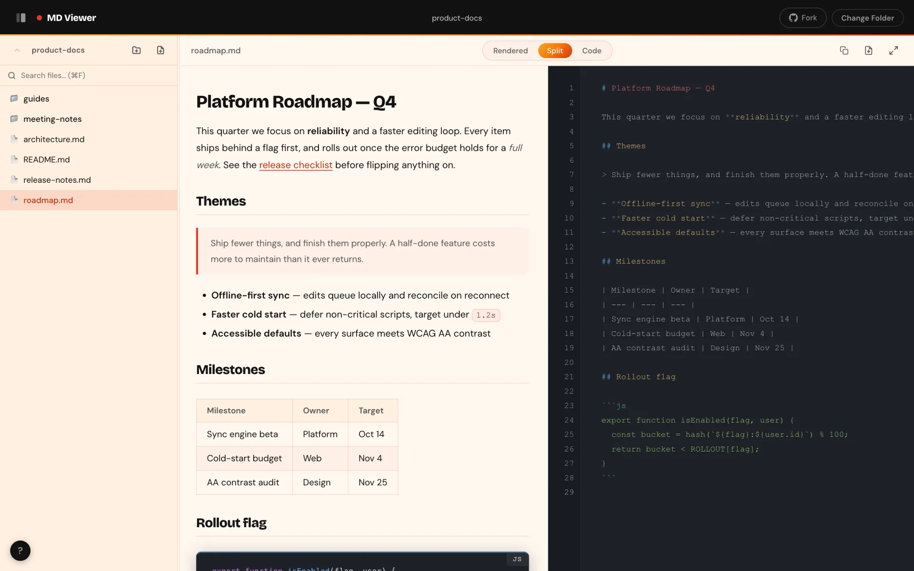
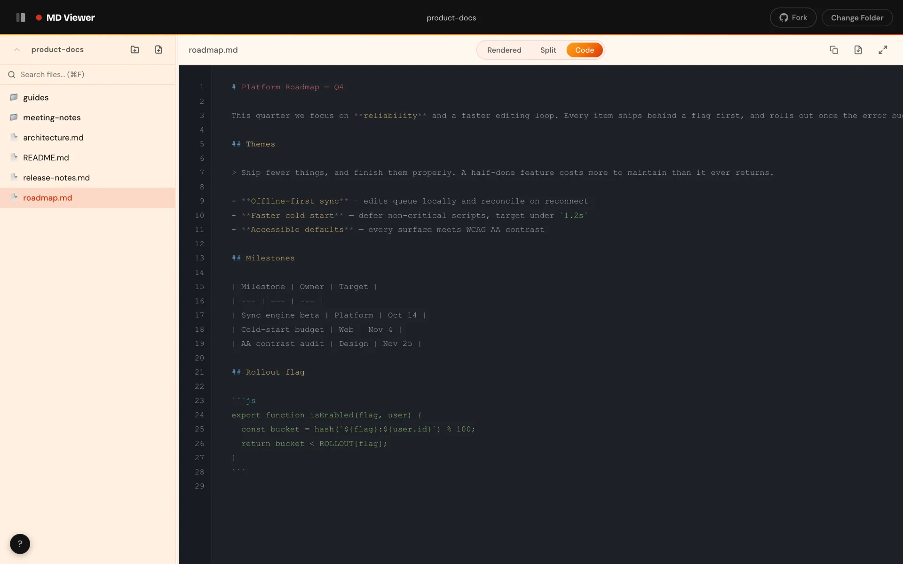
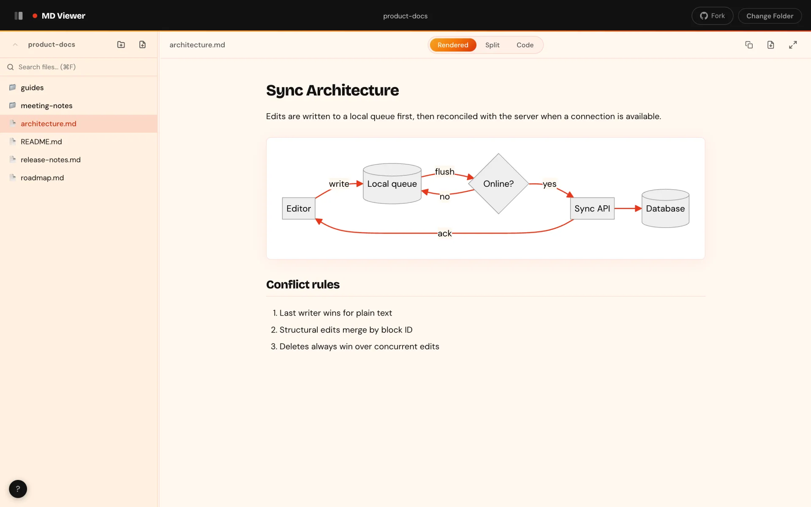
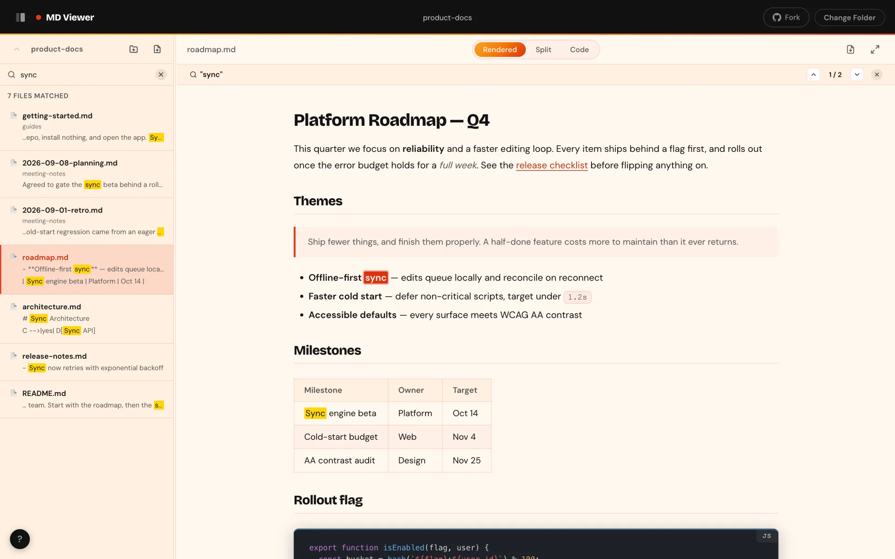
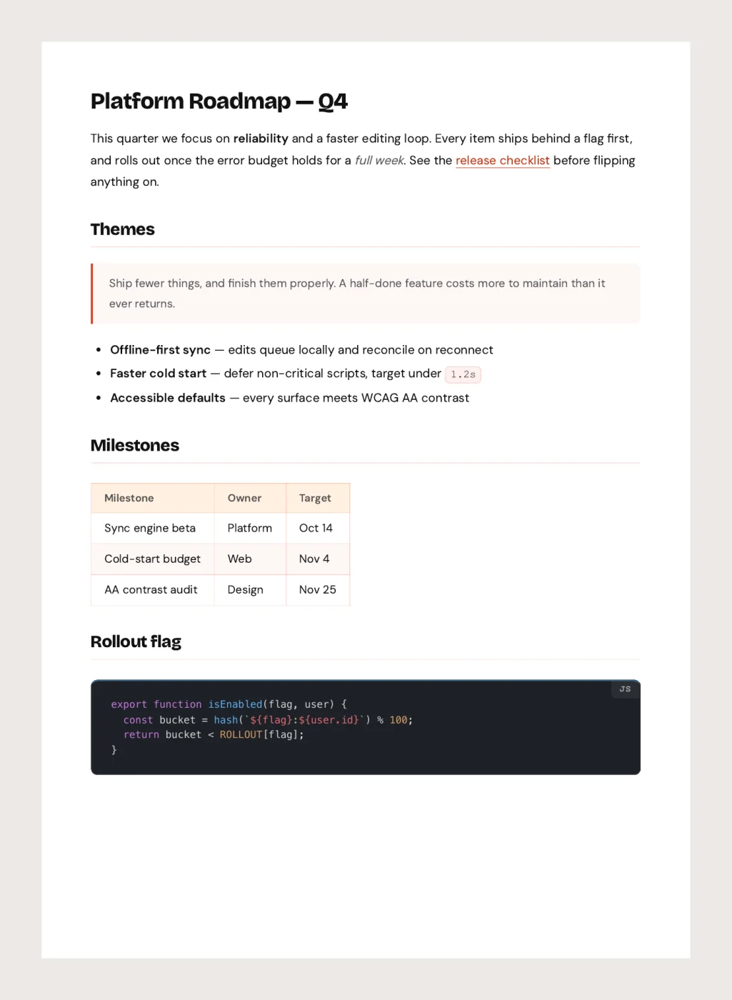
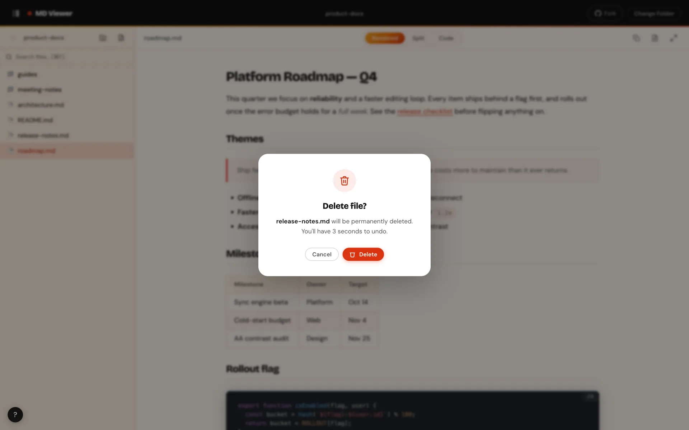
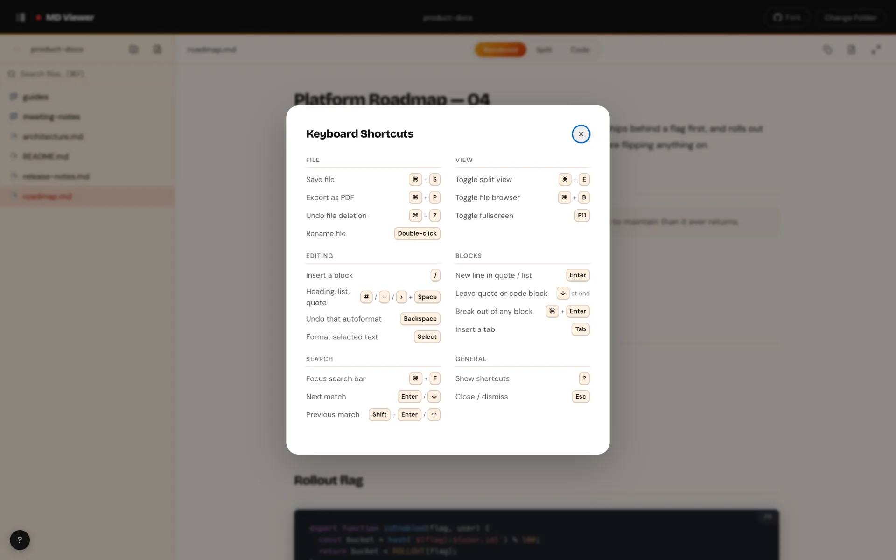

<div align="center">


# MD Viewer

A fully client-side Markdown viewer and editor. Browse your local folders, write directly in the rendered article, switch to the raw source when you need it, and save back to disk. Everything runs in the browser: no uploads, no server, nothing to install.

<a href="https://www.producthunt.com/products/md-viewer-2?embed=true&utm_source=badge-featured&utm_medium=badge&utm_campaign=badge-md-viewer-2" target="_blank" rel="noopener noreferrer"></a>

## Live Demo

🌐 **Try it now**: https://flavida.co/md-viewer
</div>



---

## Contents

- [Features](#features)
  - [Browse local folders](#browse-local-folders)
  - [Write in the rendered view](#write-in-the-rendered-view)
  - [Slash commands and Markdown shortcuts](#slash-commands-and-markdown-shortcuts)
  - [Rendered, Split and Code views](#rendered-split-and-code-views)
  - [Mermaid diagrams](#mermaid-diagrams)
  - [Full-text search](#full-text-search)
  - [Export to PDF](#export-to-pdf)
  - [File management](#file-management)
  - [Keyboard shortcuts](#keyboard-shortcuts)
- [Browser support](#browser-support)
- [Getting started](#getting-started)
- [How it works](#how-it-works)
- [Development](#development)
- [File structure](#file-structure)
- [Dependencies](#dependencies-cdn-no-install)
- [Customisation](#customisation)
- [Contributing](#contributing)

---

## Features

### Browse local folders

Pick any folder on your machine and move through it like a file manager. The sidebar lists sub-folders and Markdown files (`.md`, `.markdown`) only, so other file types never clutter the tree.

- **Breadcrumb navigation.** Click any segment in the header to jump back up the path, or use the **↑** button.
- **Opens in the rendered view.** Selecting a file renders it immediately, with syntax-highlighted code blocks.
- **Collapsible, resizable sidebar.** Drag the divider to resize it, or hide it with `Ctrl+B` / `⌘B`.
- **Fullscreen.** Press `F11` to give the article the whole window, and `Esc` to come back.

### Write in the rendered view



You don't need to touch the Markdown source to edit a file. The rendered article is editable in place, and every change is written back to Markdown as you type.

Select any text and a format toolbar appears above it:

| Group | Formats |
|-------|---------|
| Headings | H1, H2, H3 |
| Inline | Bold, italic, strikethrough, inline code, highlight, subscript, superscript |
| Blocks | Quote, code block, bulleted list, numbered list |
| Reset | Clear formatting |

- **Formats compose.** Bold text can also be highlighted and superscripted, and removing one format leaves the others intact. Buttons light up for every format already applied to the selection.
- **Every format toggles.** Pressing a format that's already applied removes it, including code blocks and quotes.
- **Plain-text paste.** Pasting from a web page or document inserts the text only, so stray styling never ends up in your file.
- **Code blocks stay editable.** Edit code in place; line breaks are preserved exactly.

### Slash commands and Markdown shortcuts



Type `/` on a line to open the block menu. Keep typing to filter it (`/quo` finds Quote), move with `↑` / `↓`, and press `Enter` or `Tab` to insert. `Esc` closes it.

| Block | What it inserts |
|-------|-----------------|
| Text | Plain paragraph |
| Heading 1, 2, 3 | Section titles |
| Bulleted list / Numbered list | Unordered and ordered lists |
| Quote | Callout or citation |
| Code block | Fenced code |
| Divider | Horizontal rule |

If you already know Markdown, just type it. These convert as soon as you press `Space` at the start of a line:

| Type | Becomes |
|------|---------|
| `#` `##` `###` | Heading 1, 2 or 3 |
| `-` or `*` | Bulleted list |
| `1.` | Numbered list |
| `>` | Quote |

Meant the literal characters? Press `Backspace` straight away and the formatting is undone, with your `#` or `-` put back.

Moving between blocks follows the same rules everywhere:

- **`Enter`** adds a new line inside the current quote or list, rather than starting a new one. On an empty list item it ends the list.
- **`↓`** at the end of a quote or code block steps out of it, creating a plain paragraph below if there isn't one.
- **`Ctrl+Enter` / `⌘Enter`** breaks out of any quote or list immediately, even with text still to the right of the caret.

### Rendered, Split and Code views



Switch views from the toolbar at any time. Unsaved edits carry across every view.

- **Rendered.** The editable article, shown above.
- **Split.** The article and its Markdown source side by side, starting at an even 50/50. Drag the divider to rebalance it. Edits on either side appear on the other almost immediately. Toggle with `Ctrl+E` / `⌘E`.
- **Code.** The raw Markdown with line numbers and syntax highlighting.



### Mermaid diagrams



Fenced ` ```mermaid ` blocks render as live SVG diagrams: flowcharts, sequence diagrams, Gantt charts and more, themed to match the app. The diagram source is kept intact when the file is edited and saved.

### Full-text search



Press `Ctrl+F` / `⌘F` to search every Markdown file in the open folder, including sub-folders. Each result shows the file name, its folder, and a snippet around the match.

Open a result and every occurrence is highlighted. The match navigator shows your position (`1 / 2`) and steps through matches with `Enter` / `Shift+Enter` or the arrow buttons. The current match is orange; the rest are yellow.

### Export to PDF

<p align="center">
  
</p>

Click the export icon in the toolbar, or press `Ctrl+P` / `⌘P`, and choose **Save as PDF** in the print dialog. The PDF uses the same typography, code highlighting and colours as the rendered view, on a clean white page with margins. App chrome such as the sidebar and toolbars is left out, and the file name is suggested from the document.

If you export from the Code view with unsaved changes, the PDF still reflects your latest edits.

### File management



- **Create.** The `+` buttons in the sidebar create a new file or folder and put it straight into rename mode.
- **Duplicate.** Copies the open file as `title (2).md`, `title (3).md` and so on, then opens the copy.
- **Rename in place.** Double-click any name in the sidebar, or the file name in the toolbar. `Enter` saves, `Esc` cancels.
- **Move.** Drag a file or folder onto another folder. Drop it on the folder name in the sidebar toolbar to move it up a level. A confirmation appears before anything moves.
- **Delete with undo.** Confirm, then you have 3 seconds to press **Undo** or `Ctrl+Z` / `⌘Z`. Folders are deleted with their contents.
- **Save.** The Save button appears once there are unsaved changes, from any view. Press `Ctrl+S` / `⌘S` to write the file back to disk.

### Keyboard shortcuts



Press `?` anywhere in the app to see these. On macOS, use `⌘` in place of `Ctrl`.

**File**

| Shortcut | Action |
|----------|--------|
| `Ctrl+S` | Save the current file |
| `Ctrl+P` | Export as PDF |
| `Ctrl+Z` | Undo a file or folder deletion (during the 3 s window) |
| Double-click | Rename a file or folder |

**View**

| Shortcut | Action |
|----------|--------|
| `Ctrl+E` | Toggle Split view |
| `Ctrl+B` | Toggle the file sidebar |
| `F11` | Toggle fullscreen |

**Editing** (rendered view)

| Shortcut | Action |
|----------|--------|
| `/` | Open the block menu |
| `↑` / `↓`, then `Enter` or `Tab` | Choose a block in the menu |
| `#`, `-`, `*`, `1.`, `>` then `Space` | Autoformat the line |
| `Backspace` (right after autoformat) | Undo the autoformat |
| `Enter` | New line in the current quote or list |
| `↓` (at the end) | Leave a quote or code block |
| `Ctrl+Enter` | Break out of any quote or list |
| `Tab` | Insert a tab |

**Search**

| Shortcut | Action |
|----------|--------|
| `Ctrl+F` | Focus the search bar |
| `Enter` / `Shift+Enter` | Next / previous match |
| `↓` / `↑` | Next / previous match (when focus is outside the editor) |

**General**

| Shortcut | Action |
|----------|--------|
| `?` | Show keyboard shortcuts |
| `Esc` | Close menus and dialogs, then the match navigator, clear search, then exit fullscreen |

---

## Browser support

MD Viewer needs the [File System Access API](https://developer.mozilla.org/en-US/docs/Web/API/Window/showDirectoryPicker) to read and write your folders directly.

| Browser | Supported |
|---------|-----------|
| Chrome  | 86+ |
| Edge    | 86+ |
| Opera   | 72+ |
| Safari  | No |
| Firefox | No |

Safari and Firefox don't implement `showDirectoryPicker`, so they can't open a local folder. The app shows a notice if you try.

---

## Getting started


### Option 1: open the file directly

1. Clone or download this repository.
2. Open `index.html` in Chrome or Edge.
3. Click **Open a Folder** and choose a folder that contains Markdown files.

> The browser asks for permission before it reads your files. Nothing leaves your device.

### Option 2: run a local server

Serve the folder over HTTP if your browser restricts the API on `file://` URLs:

```bash
python3 serve.py
```

Then open `http://localhost:8787`. `serve.py` is a small wrapper around Python's built-in server that disables caching, so you always see your latest changes. Any static server works too:

```bash
npx serve /path/to/md-viewer
```

---

## How it works

### File access and permissions

When you click **Open a Folder**, the browser shows its own permission dialog for read and write access. This is handled entirely by the [File System Access API](https://developer.mozilla.org/en-US/docs/Web/API/File_System_API); no code on the page can reach your files without that grant.

Permissions last for the session. Next time you open the app, you pick a folder again. No file paths or handles are stored.

### Editing in the rendered view

While you type in the rendered article, the page itself is the source of truth. The app converts it back to Markdown in the background and updates the source, so what you see and what gets saved stay in step. It doesn't re-render the article on every keystroke, which keeps the caret exactly where you left it.

These round-trip cleanly between the rendered view and the saved file:

| Element | Markdown |
|---------|----------|
| Headings | `#`, `##`, `###` … |
| Bold, italic, strikethrough | `**bold**`, `*italic*`, `~~strike~~` |
| Inline code | `` `code` `` |
| Highlight, subscript, superscript | `==mark==`, `~sub~`, `^sup^` |
| Quotes | `> quote` |
| Lists | `- item`, `1. item` |
| Code blocks and Mermaid | Fenced ` ``` ` blocks |
| Links, images, tables, dividers | Standard Markdown |

### Navigation model

The sidebar works like Finder or File Explorer in list view:

- **Single-click** a folder to open it (after a short delay, so a double-click can rename instead).
- **Double-click** any file or folder to rename it.
- Use **↑** or a breadcrumb segment to go back up.
- Drag an item onto a folder to move it.

### Search

Search reads every Markdown file under the open folder and lists the matches in folder order. Clearing the search returns the sidebar to the folder holding the file you opened, and keeps your scroll position in the article.

### Saving

1. The browser may ask for write permission the first time you save in a session.
2. The file is written in place with `FileSystemFileHandle.createWritable()`.
3. The rendered view updates to reflect the saved content.

### localStorage

These preferences are stored locally under `mdviewer-prefs` and never sent anywhere:

| Key | Value |
|-----|-------|
| `panelWidth` | Sidebar width in pixels |
| `isPanelCollapsed` | `true` or `false` |
| `currentView` | `rendered` or `code` (Split reopens as Rendered) |

To reset them, run `localStorage.removeItem('mdviewer-prefs')` in the browser console.

---

## Development

There's no build step. Three small tools keep changes safe:

**Run the editor tests.** Open a file in the app, then run this in the browser console:

```js
await runEditorTests()
```

It runs 123 checks against the rendered editor: Markdown round-trips, every format toggling on and off, formats composing, block escapes, lists, code blocks, the slash menu, autoformat, paste and split view. It returns `{ passed, failed, total, failures }`.

**Serve without caching.** `python3 serve.py [port] [directory]` defaults to port `8787` and sends `no-store` headers, so the browser never serves you a stale stylesheet or script.

**Stamp asset versions before committing.** Run:

```bash
./bump.sh
```

It adds a content hash to the `style.css` and `app.js` URLs in `index.html` (for example `style.css?v=65acec55`). Browsers cache these files by URL and can keep an old copy for hours, even on GitHub Pages; a changed URL guarantees visitors get the new version.

---

## File structure

```
md-viewer/
├── index.html          App shell, landing screen, toolbars and menus
├── style.css           All styles: Flavida tokens, layout, Markdown typography, print
├── app.js              All app logic: file system, editor, views, search, export
├── test-editor.js      Browser test suite for the rendered editor
├── serve.py            Local dev server with caching disabled
├── bump.sh             Stamps content hashes onto asset URLs
└── docs/screenshots/   Images used in this README
```

No `package.json`, no bundler, no framework.

---

## Dependencies (CDN, no install)

| Library | Version | CDN | Purpose |
|---------|---------|-----|---------|
| [marked](https://marked.js.org) | 9.1.6 | cdnjs | Markdown to HTML |
| [DOMPurify](https://github.com/cure53/DOMPurify) | 3.0.8 | cdnjs | Sanitising rendered HTML |
| [highlight.js](https://highlightjs.org) | 11.9.0 | cdnjs | Syntax highlighting |
| [Mermaid](https://mermaid.js.org) | 10 | jsDelivr | Diagram rendering |
| [Google Fonts](https://fonts.google.com) | – | Google | Bricolage Grotesque and DM Sans |

The app keeps working offline if your browser has cached these. For fully offline use, download them and point `index.html` at the local copies.

---

## Customisation

### Default sidebar width

Change `--panel-w` in `style.css`:

```css
:root {
  --panel-w: 280px;
}
```

### Colours

All colours are Flavida design tokens at the top of `style.css`. The accent comes in three variants so it stays readable wherever it's used:

| Token | Value | Use |
|-------|-------|-----|
| `--color-flame` | `#E8391D` | Fills, borders, icons |
| `--color-flame-text` | `#C7300F` | Accent text on light backgrounds |
| `--color-flame-deep` | `#D9330F` | Backgrounds behind white text |

If you change the accent, keep the text and deep variants at a contrast ratio of at least 4.5:1 against the surfaces they sit on.

### Other file types

The sidebar filter lives in `loadDirectory()` in `app.js`:

```js
} else if (name.toLowerCase().endsWith('.md') || name.toLowerCase().endsWith('.markdown')) {
```

Add more extensions there, such as `.txt`, to list them.

---

## Contributing

This project is static and dependency-free, and contributions should keep it that way: no build tools, frameworks or npm packages.

1. Fork the repository.
2. Make your changes to `index.html`, `style.css` or `app.js`.
3. Run `python3 serve.py`, open a folder, and run `await runEditorTests()` in the console.
4. Run `./bump.sh`.
5. Open a pull request explaining what changed and why.

---

## Licence

MIT. See [LICENSE](LICENSE) for details.
